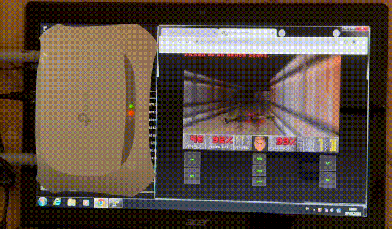
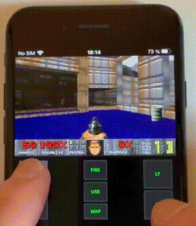

# DOOM on router (MIPS architecture)
Play DOOM on your Wi-Fi router! This project ports [doomgeneric](https://github.com/ozkl/doomgeneric) to routers based on the **MIPS (mipsel) architecture**. The game runs headless on the router and streams the video to any browser via WebSockets.

Many routers are built on this architecture (MIPS is widely used in low-cost and older routers). Check out the list of [compatible routers](docs/compatibility.md).

If you have one, you can try it!



<details>
  <summary>iPhone gameplay</summary>

  

  > The image is streamed from the router to the iPhone via Wi-Fi
</details>

## Requirements
- Router based on **MIPS little-endian (mipsel)** architecture
- **OpenWrt** firmware installed (stock firmware probably will **not** work) — [check compatibility](https://toh.openwrt.org/?view=normal)

To check if your model is compatible, follow the [instructions](docs/compatibility.md).

### Tested on:

#### TP-Link TL-WR840N v6  
- SoC: MediaTek [MT7628AN](https://deviwiki.com/wiki/MediaTek_MT7628)  
- Memory: Flash - 4MB / RAM - 32MB   
- Architecture: MIPSel (little-endian)  
- OS: [OpenWrt](https://openwrt.org/) v.21.02  

#### Asus RT-N10 rev C1  
- SoC: Ralink RT3350  
- Memory: Flash - 4MB / RAM - 32MB  
- Architecture: MIPSel (little-endian)  
- OS: [OpenWrt](https://openwrt.org/) v.21.02 

# How it works
The router doesn't have a display, so it runs a DOOM engine that renders frames. The finished frames are then sent via WebSocket to any device with a browser connected to the router (laptop, smartphone, etc.). Controls (key and touch presses) are sent from the connected device back to the router. This allows you to fully enjoy playing DOOM remotely.
**Note:** In theory, you could solder a display to free pins such as GPIO or SPI and turn the router into a standalone game console.

# How to run
0 - Prepare router. Turn it on and connect it directly to your PC or to a local network. Make sure you have access to the router via SSH(replace the ip and user with your own):
```bash
ssh root@x.x.x.x
```  
1 - Clone this repository  
2 - Simply download the [ready-to-run DOOM executable](docs/executables.md) if you have a compatible model; otherwise, [build](docs/build.md) it for your architecture  
3 - Copy doomgeneric executable to the router
  > **Important!** Check available free memory first (via command `df -h`). This can be a problem because routers often have limited storage space. In my case, there was only enough free memory in `/tmp` folder, which is cleared after every reboot  

4 - Download and copy [WAD](docs/wad.md) file (game data) to the same folder on the router  
5 - On the router allow DOOM executable file to run:
```bash
chmod +x /tmp/doomgeneric
```
5 - Run it!
<details>
    <summary>Router logs after the launch DOOM:</summary>

    
    root@OpenWrt:/tmp# ./doomgeneric
    Starting Doom (WS streaming)...
    c25064 3 mongoose.c:4896:mg_mgr_init    MG_IO_SIZE: 16384, TLS: none
    c25065 3 mongoose.c:4807:mg_listen      1 4 http://0.0.0.0:8000
    DG_Init executed...
                            Doom Generic 0.1
    Z_Init: Init zone memory allocation daemon.
    zone memory: 0x777e3010, 600000 allocated for zone
    Using . for configuration and saves
    V_Init: allocate screens.
    M_LoadDefaults: Load system defaults.
    saving config in .default.cfg
    -iwad not specified, trying a few iwad names
    Trying IWAD file:doom2.wad
    Trying IWAD file:plutonia.wad
    Trying IWAD file:tnt.wad
    Trying IWAD file:doom.wad
    Trying IWAD file:doom1.wad
    W_Init: Init WADfiles.
    adding doom1.wad
    Using ./.savegame/ for savegames
    ===========================================================================
                                DOOM Shareware
    ===========================================================================
    Doom Generic is free software, covered by the GNU General Public
    License.  There is NO warranty; not even for MERCHANTABILITY or FITNESS
    FOR A PARTICULAR PURPOSE. You are welcome to change and distribute
    copies under certain conditions. See the source for more information.
    ===========================================================================
    I_Init: Setting up machine state.
    M_Init: Init miscellaneous info.
    R_Init: Init DOOM refresh daemon - ...................
    P_Init: Init Playloop state.
    S_Init: Setting up sound.
    D_CheckNetGame: Checking network game status.
    startskill 2  deathmatch: 0  startmap: 1  startepisode: 1
    player 1 of 1 (1 nodes)
    Emulating the behavior of the 'Doom 1.9' executable.
    HU_Init: Setting up heads up display.
    ST_Init: Init status bar.
    I_InitGraphics: framebuffer: x_res: 320, y_res: 200, x_virtual: 320, y_virtual: 200, bpp: 32
    I_InitGraphics: framebuffer: RGBA: 8888, red_off: 16, green_off: 8, blue_off: 0, transp_off: 24
    I_InitGraphics: DOOM screen size: w x h: 320 x 200
    I_InitGraphics: Auto-scaling factor: 1
    

</details>

6 - Open a browser and go to the address:
```
http://x.x.x.x:8000/
```
Replace x.x.x.x with your router's IP address

7 - Have fun!  
Use WASD/arrows to move, space - fire, E - use, Q/R - strafe.

# Credits
Forked from [doomgeneric](https://github.com/ozkl/doomgeneric)  
Network library for WebSockets - [Mongoose](https://github.com/cesanta/mongoose)  

# Troubleshooting
> Errors when running the DOOM executable: "File not found" or "Shared library missing (*.so)"
  **Cause:** By default, the compiler uses dynamic linking. The program expects to find system libraries (like libgcc_s.so.1) pre-installed on the router.
  **Solution:** Use static linking to bundle all dependencies into a single binary. Note that the executable will increase in size.
  - Open Makefile.mips
  - Change variable `STATIC_LINKING` to 1: `STATIC_LINKING ?= 1`
  - Rebuild project


## TODOs
- Add Y/N controls
- Create doomgeneric package for opkg
- Add benchmarks
- Check on ARM arch